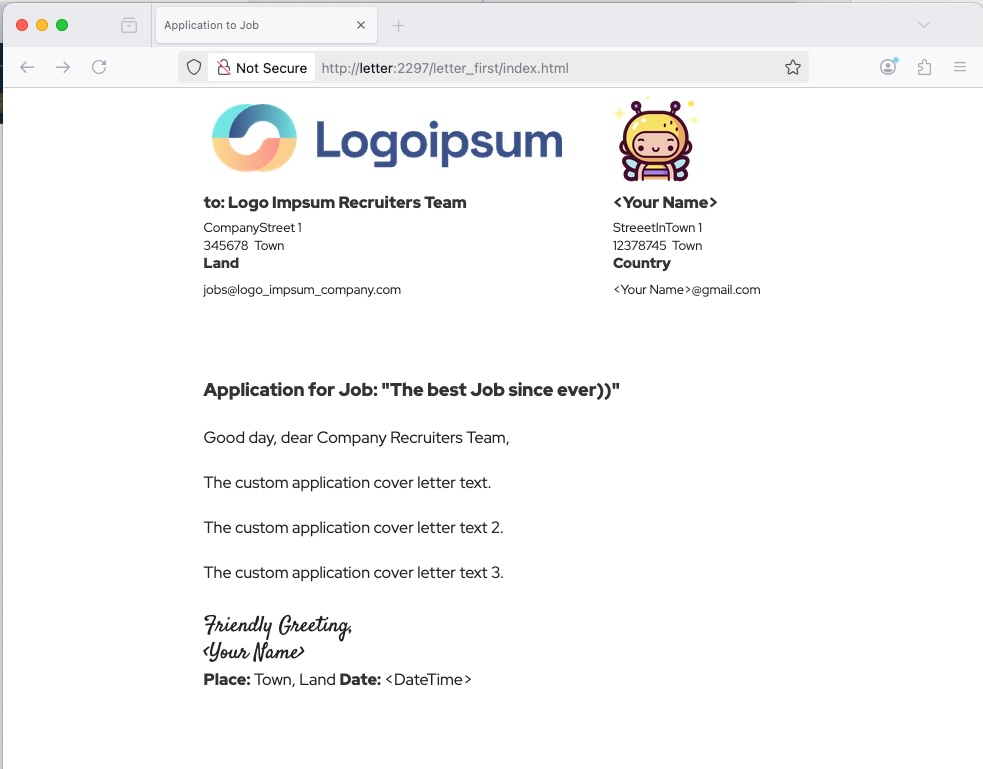
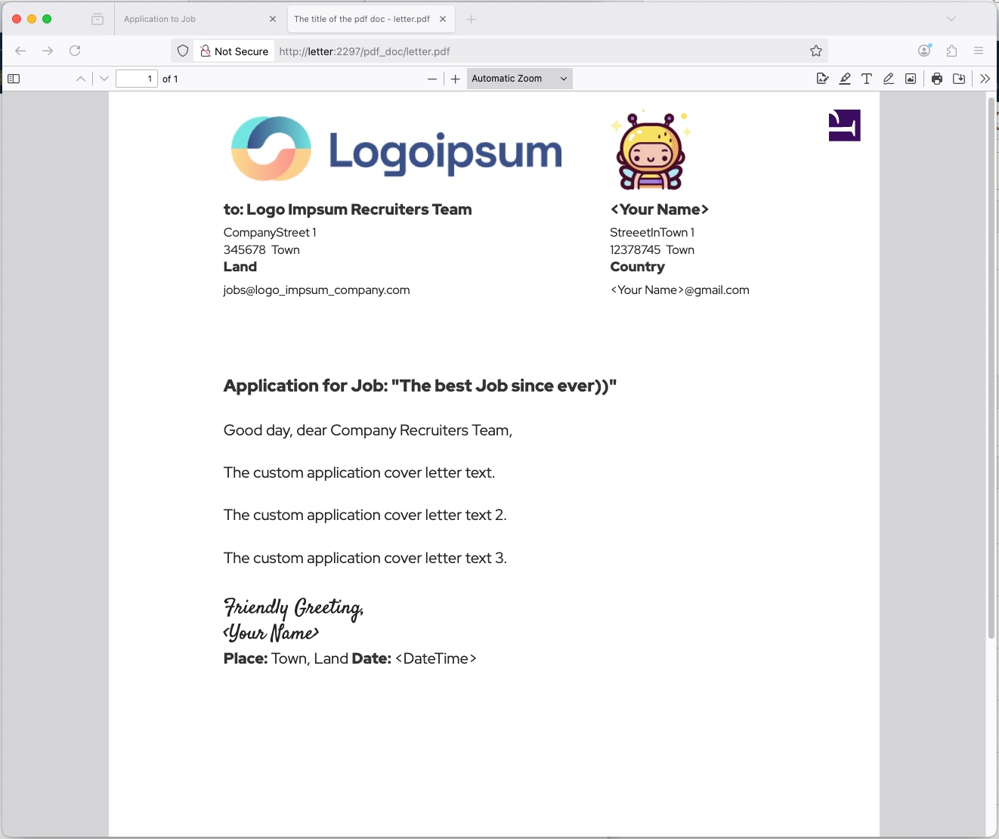
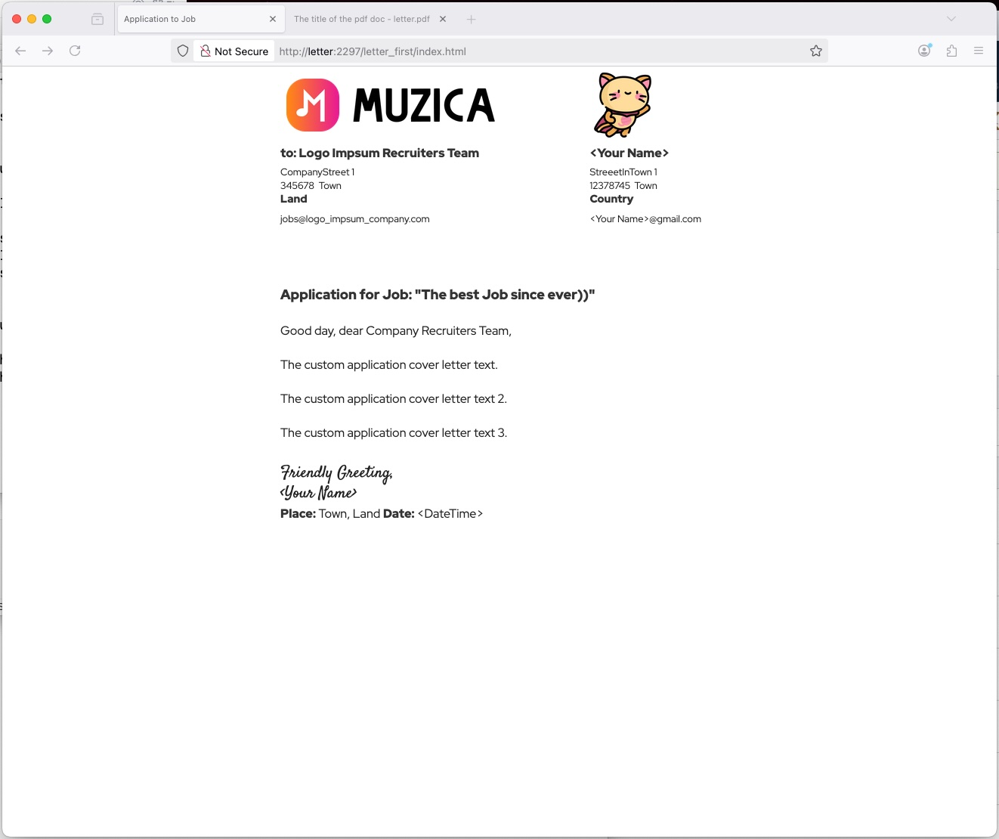
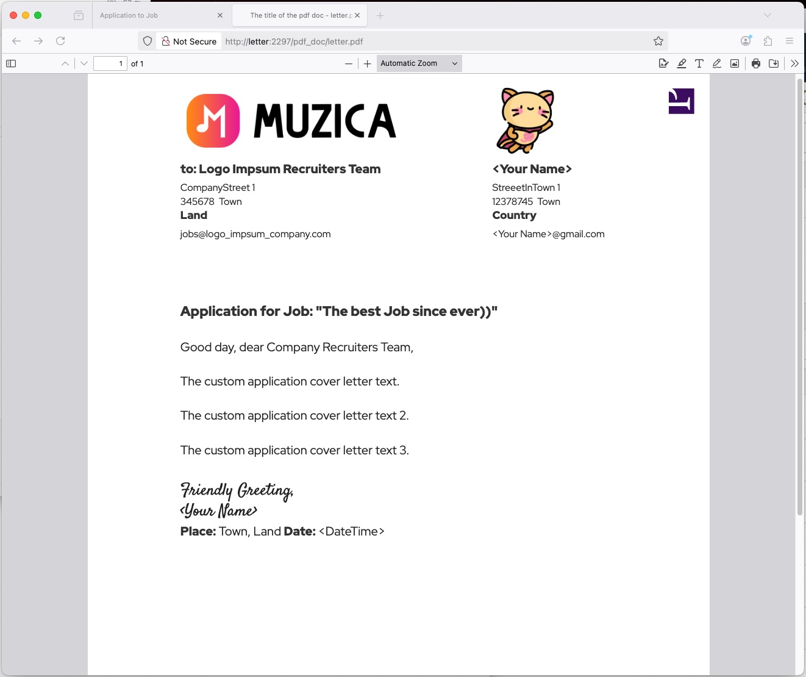

<!-- software labels -->
[](https://www.princexml.com/)
[](https://www.php.net/)


`12th of April 2026`
> **In reconstruction**, the very nice **docker compose update**. 
> 
> In plan 2 projects: Sites Docker Environment and the html|php SPA for A4 docs viewed in Acrobat Viewer or Browsers.
> 
> I work in the moment, 13.04.2026, on
>    1. installation script `INSTALL_copy_env_examples.sh` for `.env's`
>    2. and the updated `README.md` documentation.
> 
>   Hope to push the updated README's tonight.
> 
> The documentation in the moment might not be 100% the right one.
> 
> Please, see 
>    1. `example_docker-compose.yml` conf, 
>    2. `docker_compose` folder,
>    3. `INSTALL_copy_env_examples.sh` script, 
>    4. make copies of `example_'s` to => `.env's`, 
>    5. make folder `command/security` with passwords `.owner_pwd` and `.user_pwd` for the produced docs.
> 
> `INSTALL_copy_env_examples.sh` makes later copies `example_env's` to => `.env's`, since **all .env's are .gitignored**.
>
> hashed password in .envs hardcoded always "asd". 


#  A4DC 
  > **A4 Electronic Document** for printing or sending via email, by **Docker Compose** Technology.

  > Software of Company **Princexml.com** requires license. 
  > 
  > This application is the example of producing A4 Electronic Documents from an `.html` page by Software like **Prince**.


`start, stop, restart, status, restartus))`


- dck.basetasks.site
- local.basetasks.site
- https: 8447
- http: 2997


https://local.basetasks.site:8447/

https://local.basetasks.site:8447/favicon.ico

https://local.basetasks.site:8447/Letters/letter_first/

https://local.basetasks.site:8447/Letters/LetterTemplate/

https://local.basetasks.site:8447/jaisocx/

https://local.basetasks.site:8447/cdn/

https://local.basetasks.site:8447/readme/


```bash

  cd "./workspace/cdn"
  yarn install
  # npm install

  cd "./workspace/php_packages"
  composer install

```


```bash

  docker compose -f "./docker-compose.yml" stop a4dc 
  docker compose -f "./docker-compose.yml" rm a4dc --volumes
  docker compose -f "./docker-compose.yml" build a4dc
  docker compose -f "./docker-compose.yml" create a4dc 
  docker compose -f "./docker-compose.yml" start a4dc 
  docker compose -f "./docker-compose.yml" restart a4dc 
  docker compose -f "./docker-compose.yml" logs a4dc 
  docker compose -f "./docker-compose.yml" exec a4dc bash 
  docker compose -f "./docker-compose.yml" ps
  docker compose ps

```












#### Friendly greetings

  Jaisocx Software Architect
  
  Elias
  

