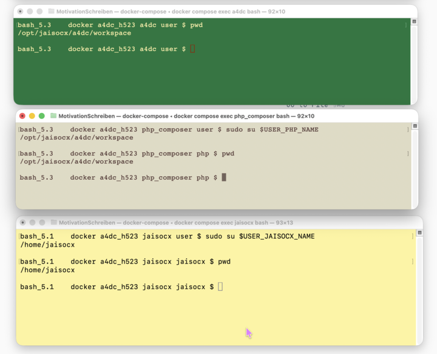

`Docker for a Site`

[software_labels preview](./README_software_labels.md)

  **HOME**

---

  >  🗓  **Updated**:  🌼 Summer 2026, Sun. 28 jun. 17:40:03

---

  ⛔  **Warning July 2026!!! don't update, first do backup!!! all project data could get lost, changed several configurations**.

  > for js developers, first learned docker and databases

  ⛔  **Warning Project Sync** ".env's Lost Unattended" after **git pull**.

  ⛔  **Warning Project Sync** "Database Lost Unattended" if **Docker conf was updated**.

  **Before** every `git pull` to **update** this project,
  even without checking whether Docker settings were changed,
  first do **MySQL db dump** and db dump **backup**,
  since this project is with a dockerized MYSQL DATABASE Instance.
  
  **Databases** under Docker **recreate a fresh and clean db instance**,
  when some Docker config file was changed,
  and after `git pull && docker compose restart`, too.

---

# Docker for a Site
 > For a **Site**, several **Docker** services by **Alpine** Image with `.env`, `Dockerfile`, `ENTRYPOINT`, services configurations like `http-conf.xml` and `php-fpm.conf`.

 > Refinements in the current February 2026 review after 3 months release before.

  - ✅ [**Ideas, Why Coded What**](./workspace/readme_sites_docker/r_docker/README_Ideas_why_coded_what.md).

  - ✅ **Newer Workaround for Docker Compose**.

  - ✅ **A. Aligned All Services**.

  - ✅ **B. Workarounds improve quality and easen work day**.

  - ✅ **C.** [**Code snippets for reuse by copy-paste**](./workspace/readme_sites_docker/r_docker/README_Docker_Code_Snippets.md).

  - ✅ **D.** [**Typescript Environment**](./README_typescript_environment.md).

  - ✅ **E.** [**A4DC**](./README_a4dc.md).

  1. ✅ [**Network**](./workspace/readme_sites_docker/r_docker/README_Docker_Networks.md), firewall, ports, ip, domain names, ssl, https.

  2. ✅ [**Users**](./workspace/readme_sites_docker/r_docker/README_Docker_Users.md), groups, name, id, password, privilegs.

  3. ✅ **Envs**, docker-compose.yml, Dockerfile, ENTRYPOINT, php-fpm confs.

  4. ✅ **Tarballs** for reuse on reinstall.

  5. ✅ [**Docker Env Theories**](./workspace/readme_sites_docker/r_docker/README_Docker_Env.md).

## Ideas, Why coded what

  - Why **Docker**
  - When Docker, why **Alpine**
  - Why **bash** 
  - Why **sudo** ( see [**Users** => 4.](./workspace/readme_sites_docker/r_docker/README_Docker_Users.md) )

## Newer Workaround for Docker Compose
  > Just one Service, for Sites, added to network with internet and has open port(s): **jaisocx_dc_opened_one_for_browsers_network**

  > But, another mode with the open network added to every docker service ( **jaisocx_dc_opened_for_inet_installs_network** ), is needed for inet installs.

  > Several docker services by same context ( `docker_compose/PHP/docker` ) in same time ( both **php_composer** and **php_fpm** ) don't do.

  ✅ 2 services for **php-fpm**
  
  - **php_composer** with XDebug for engineering
  - **php_fpm** for production
  
  In order to install **3rd parties php libs** to `vendor` folder, one service **php_composer** with **XDebug**, **has open network** for inet intsalls.
  
  The other, **php_fpm**, remains encommented.

  In **production**, after having installed 3rd parties libs to `vendor` folder by **composer**, the deployd volume keeps `vendor`, and many sites ( if no requests by php in internet ), work in local Docker Network, and without XDebug.
  
  In production, php serves by **php_fpm**.
  
  The open network, ( **jaisocx_dc_opened_for_inet_installs_network** ), needs to be **encommented**, either, for the new workaround `Just One Service has open Network`.

  **docker compose build**

### Envs for Jaisocx with php-fpm
  **Jaisocx** Line 30: `docker_compose/Jaisocx_SitesServer/http/etc/server.properties` | php.fpm.host=phpfpm.basetasks.site:9020

  **php** Line 34: `docker-compose.yml` | file: "./docker_compose/PHP/.env_php_fpm"

  **php** Line 35 encommented: `docker-compose.yml` | # file: "./docker_compose/PHP/.env_php_composer"

  **php** Line 21: `.env` | PHP_FPM_DOMAIN_NAME="phpfpm.basetasks.site"

  **php** Line 10: `docker_compose/PHP/.env_php_fpm` | PHP_FPM_FLAT_PORT=9020

## A. Aligned All Services

  - Alpine one image
  - bash for console
  - Workspace VOLUME same .env bash variable

## B. Workarounds improve quality and easen work day
  > knowledge, control and transparency

  1. Fine-grained filesystem structure for the **Docker Context** for `Dockerfile` and **Mounted Volumes** for `Workspace`.

  2. `ENTRYPOINT` saves USER's **bash profile** with env variables exports and **bash template inclusion**.

  3. **Markers** for `ENTRYPOINT` code blocks **run once the first time**.

## C. Code snippets for reuse by copy-paste
  > Examples of use like code snippets for reuse by copy-paste.

  1. `.env` **bash variables** for `docker-compose.yml`, `Dockerfile`, `ENTRYPOINT`

  2. **dynamic bash variables** in `${workspace}/env_dc_dinamique/.env*`, renew on `docker (re)start`, take effect in `if` expressions in `ENTRYPOINT`.

  3. `docker-compose.yml`

  4. `Dockerfile` and `ENTRYPOINT`

## 1. Network

### Aim of the Setup
  > Fine tuning 
  
  - ✅ Firewall
  - ✅ ports
  - ✅ ip
  - ✅ domain names
  - ✅ ssl
  - ✅ https
  - ✅ Services' network confs
  - ✅ Signed Wildcard SSL Certificate for any subdomain of **basetasks.site**.
  - ✅ Local and Open Docker Networks
  - ✅ The option to set the **fine-grained security confs** like `allowed_clients`, for sure, of greate use for Databases confs. 
  > 💡 If, or when, You or System Admin change or add a network for a service, or add another open network, still, the single allowed client's IP has effect, and the first time at once NO data compromizing because of unintended open port doesn't occur.

## 2. Users
  
### 💡 Aim of the Setup
  > For fine-tuning of privilegs to services on filesystem resources.

### 2.1. Easy in development

  - Known **Volume's Owner** `user:group`.

  - Known Docker **Service's Owner** `user:group`.

### 2.2. Secure in deployment
  > This was one of the aims, but was not done 100%. (Explained in [**Users** => 3, 4.](./workspace/readme_sites_docker/r_docker/README_Docker_Users.md) )

  Once docker service deployed to production server machine,
  after logging inn,
  **the Docker service OS' user**:
  - **isn't the Super Admin**,
  - **can not install or remove software**,
  - neither **can not change filesystem privilegs** on filesystem resources, these the user doesn't owe.
  

## 3. Envs
  > The workarounds does with a single or several .env files

  - ✅ .env ( shared for all services ) **build time**.
  - ✅ .env ( for a docker service ) **build time**, in context folder of a service, for `ENTRYPOINT`, not in `Dockerfile`.
  - ✅ .env ( shared for all services, dynamic ) in [VOLUME], **start time**.
  - ✅ User's **hashed password** example in .env USER's block.
  - ✅ Service's software turns due to **dynamic .env** boolean variables ( XDebug for php-fpm ).
  - ✅ Entrypoint prints to console due to **dynamic .env** boolean variable `WHETHER_IN_DEV_MODE`.

## 4. Tarballs
  >  💡  saves programs installations, loaded from inet for the next docker builds.

