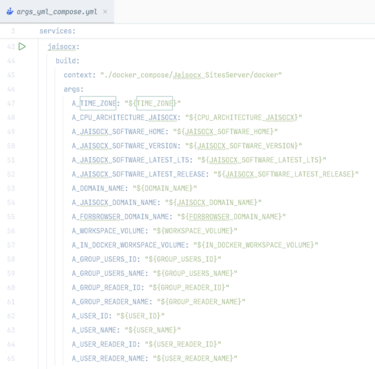

`Docker for a Site`

    

[HOME](./README_Docker.md)

---

# Users & Groups, Docker Alpine Image

  > 💡 **Users** and Users' **Groups** with **IDs and Names**,
  > in order to profit by rich Linux OS feature 
  > **Services and Filesystem Resources Privilegs granted to Users and Groups**.
  >
  > **Finer level** of grants and privilegs to
  > - Processes
  > - Software Packages,
  > - Filesystem Resources.
  >
  > This brings **the very nice level of knowledge and control**, makes **bugfixing easier**, when programming Docker service, or later entering bash instructions in docker console.  


## Plan

  1. Workarounds for **Reader** `User`, Reading-only `Processes` and Read-only `filesystem resources`.


## Done

  1. ✅ Users and Groups **set in .env** file, as bash-like `environment variables`.
  2. ✅ The easy overview of all users and groups, set in one file, one code block.
  3. ✅ Users and Groups **added in docker service** by Alpine OS docker image.
  4. ✅ **Foreseen user**, `logged inn` to the docker service's `console`.
  5. ✅ **Dedicated** `Users` and Groups for `Programm languages interpreting Engines` and `Processes` running.
  6. ✅ **Admin** Users and Groups.
  7. ✅ Users' **passwords**.
  8. ✅ Users' **home** directory.
  9. ✅ **OnLogin event** `bash` script run with user rights.
  10. ✅ Environment variables available for user's docker service's console and scripts.


## 💡 Aim of the Setup
  > For fine-tuning of grants to users.

### 1. Easy in development

  - ✅ Known **Volume's Owner** `user:group`.

  - ✅ Known Docker **Service's Owner** `user:group`.


### 2. Secure in deployment
  > This was one of the aims, but was not done 100%. (Explained in **3**, **4** )

  Once docker service deployed to production server machine,
  after logging inn,
  **the Docker service OS' user**:
  - **isn't the Super Admin**,
  - **can not install or remove software**,
  - neither **can not change filesystem privilegs** on filesystem resources, these the user doesn't owe.
  
  For example, once a conf was set unrewritable for the logging inn user,
  after having deployed to production,
  still, the Docker Service OS' user, in docker console, cannot change the conf,
  and the service works
  like was aimed before the deployment.


### 3. Secure in deployment, but:

  3.1. The User has **Super Admin privilegs**, neverhteless.

  3.2. On Host OS, logs in as the User **only with the very simple bash** instruction: ```docker compose exec <a_service> bash```

  3.3. On Host OS, in command line shell, `docker compose` can log in **as any other user** of a docker service.

  3.4. In Docker Console, **turning** to Super Admin **may bypass sudo password**.


### 4. Why can not log in to docker like a user with No admin privilegs.

  4.1. The `docker-compose.yml` bash variables in `.env` are just for `docker-compose.yml` in the `yml` code like this: `- "${WORKSPACE_VOLUME}/:${IN_DOCKER_WORKSPACE_VOLUME}/"`, not for the Dockerfile, nor the ENTRYPOINT.

  4.2. `Bash` variables for Dockerfile in `.env` need 2 extra declarations: **.yml**: `- "A_USER_NAME=${USER_NAME}"`; **Dockerfile**: `ARG A_USER_NAME`

  4.3. If **several tens** of `.env` bash variables, seems to choose the other workaround, since `.yml` with 3 services was nearly 200 lines.

  `the not easy way, however .env vars are available for Dockerfile`

  


  4.4. The other way, **secrets** or **configs** in `docker-compose.yml` are available in `ENTRYPOINT` after the Docker filesystem **was mounted**, there are **no** `.env` bash variables in `Dockerfile`.

  4.5. In order to log inn with a username, the `Dockerfile` instruction `USER` is allowed **before** the `ENTRYPOINT` Dockerfile instruction.

  4.6. Several users' groups and users, with IDs, names and passwords, **need several tens** of `.env` bash **code lines**, are read in `ENTRYPOINT`.

  4.7. New Users' groups and Users, and, after that, **setting Owners and Users' privilegs** to the core services (like `php-fpm` or `node`), and filesystem resources, **require Super Admin privilegs**.

  4.8. `USER` before the `ENTRYPOINT` instruction, needs the `USER` to be the Super Admin, or having **Super Admin privilegs**.

  4.9. The User remains the **Super Admin** for the way ( just one or two args in docker-compose.yml for a service's Dockerfile ), the `docker-compose.yml` sees normally with, let's say, **nearly 10 services** for a modern Site's requirements.

  - **PHP** with several tens of open source Frameworks and CMS for Online Stores or Sites,
  - **NodeJS** with **Express** and **Web Sockets** for server-side event driven updates on site,
  - **Python** with AI Models libraries,
  - **SQL Database**,
  - **NoSQL Database** for json,
  - **Email** Sender,
  - **SMS** Sender,
  - **Messages Queue**,
  - **Caching** Service.

---


